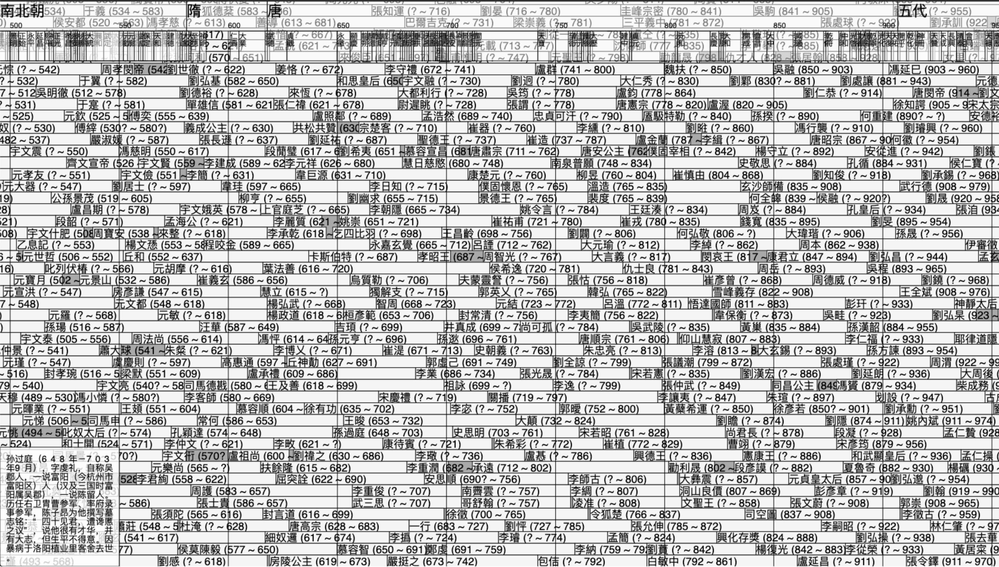
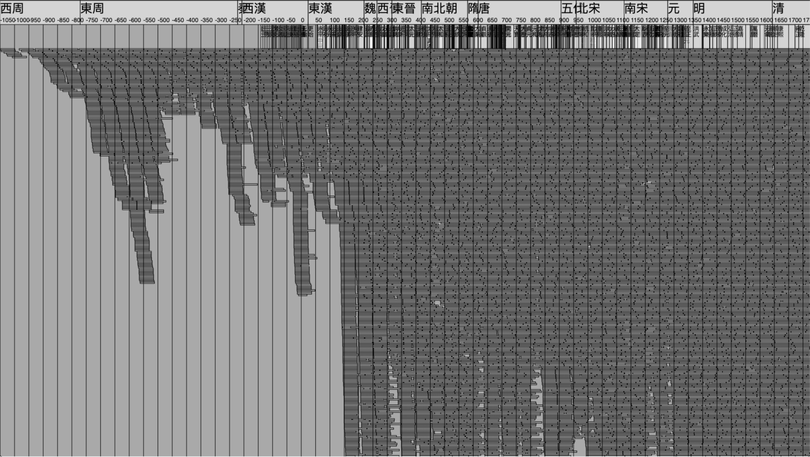

# grand-timeline 古人全表

[https://grand-timeline.netlify.com](https://grand-timeline.netlify.com) 

Grand unified timeline of 30,800 ancient Chinese people, from -1000 B.C. to 2000 A.D.. Scraped from wikipedia and made into interactive webpage.

西周以來三萬古人年表

## Features

- Free zoom/pan 平移/縮放
- Short summary for every person 人物簡介
- Dynasty + era names 朝代+年號
- Open in wikipedia 維基傳送
- Search people by name 人名檢索
